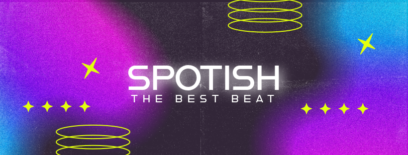
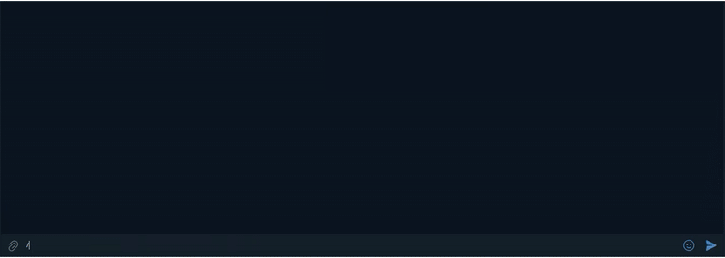

<!-- Improved compatibility of back to top link: See: https://github.com/othneildrew/Best-README-Template/pull/73 -->
<a id="readme-top"></a>
<!--
*** Thanks for checking out the Best-README-Template. If you have a suggestion
*** that would make this better, please fork the repo and create a pull request
*** or simply open an issue with the tag "enhancement".
*** Don't forget to give the project a star!
*** Thanks again! Now go create something AMAZING! :D
-->


<!-- PROJECT SHIELDS -->
<!--
*** I'm using markdown "reference style" links for readability.
*** Reference links are enclosed in brackets [ ] instead of parentheses ( ).
*** See the bottom of this document for the declaration of the reference variables
*** for contributors-url, forks-url, etc. This is an optional, concise syntax you may use.
*** https://www.markdownguide.org/basic-syntax/#reference-style-links
-->
<div align="center">

[![Contributors][contributors-shield]][contributors-url]
[![Forks][forks-shield]][forks-url]
[![Stargazers][stars-shield]][stars-url]
[![Issues][issues-shield]][issues-url]

</div>


<!-- PROJECT LOGO -->
<br />
<div align="center">
  <a href="https://github.com/xpl0z/spotish">
    
  </a>

<h3 align="center">Spotish</h3>

  <p align="center">
    Telegram bot to play music
    <br />
    <a href="#small-doc"><strong>Explore the docs »</strong></a>
    <br />
    <br />
    <a href="#demo">View Demo</a>
    &middot;
    <a href="https://github.com/xpl0z/spotish/issues/new?labels=bug&template=bug-report---.md">Report Bug</a>
    &middot;
    <a href="https://github.com/xpl0z/spotish/issues/new?labels=enhancement&template=feature-request---.md">Request Feature</a>
  </p>
</div>


<!-- TABLE OF CONTENTS -->
<details>
  <summary>Table of Contents</summary>
  <ol>
    <li>
      <a href="#about-the-project">About The Project</a>
      <ul>
        <li><a href="#built-with">Built With</a></li>
      </ul>
    </li>
    <li>
      <a href="#getting-started">Getting Started</a>
      <ul>
        <li><a href="#prerequisites">Prerequisites</a></li>
        <li><a href="#installation">Installation</a></li>
      </ul>
    </li>
    <li><a href="#demo">Demo</a></li>
    <li><a href="#roadmap">Roadmap</a></li>
    <li><a href="#contributing">Contributing</a></li>
    <li><a href="#license">License</a></li>
    <li><a href="#contact">Contact</a></li>
  </ol>
</details>


<!-- ABOUT THE PROJECT -->
## About The Project
<div align="center">
  <a href="https://github.com/xpl0z/spotish">
      
    </a>
</div>

### What is Spotish ?
Spotish is a telegram bot to play spotify link on speaker !
<p align="right">(<a href="#readme-top">back to top</a>)</p>

<!-- USAGE EXAMPLES -->
## Demo
<div align="center">

</div>
<br>
For more examples, please refer to the /start or below.  
<br>  

### Small Doc
Available commands:   
  /start - 📜 Show this menu    
  /play &lt;Spotify URL&gt; - ▶️ Play a song or ➕ add it to the queue    
  /playtop &lt;Spotify URL&gt; - ⬆️ Add a track to the top of the queue     
  /random - 🎲 Play a random song that is already download   
  /pause - ⏸️ Pause the current song    
  /resume - 🔄 Resume the paused song    
  /skip - ⏭️ Skip the current song    
  /stop - 🛑 Stop playback and 🧹 clear the queue    
  /volume &lt;0-100&gt; - 🔊 Adjust the volume    
  /adduser &lt;username&gt; - ➕ Add an authorized user (without @)    
  /search &lt;track name&gt; - 🔍 Search and play a track by name    
  /mix - ♾️ play recommendation from history   
  /download &lt;Spotify URL&gt; - 💾 Download a song or a playlist     
  /adduser &lt;username&gt; &lt;duration&gt; &lt;unit&gt; - ➕ Add an authorized user  
  /isauthorize  - ❓ Checks if someone is authorize. If there is no argument you are checking yourself. Don't put @  
  /queue &lt;index&gt; - 📋 Get future songs to play   
  /delete &lt;song_id&gt; - 🗑️ To delete a song from queue  

<p align="right">(<a href="#readme-top">back to top</a>)</p>

### Built With

* [![Python][Python]][Python-url]


<p align="right">(<a href="#readme-top">back to top</a>)</p>


<!-- GETTING STARTED -->
# Getting Started


### Prerequisites

* Before you begin installing the project, you must first have installed **Python** on your machine. Otherwise, follow the instructions below.

#### Installing Python

##### On Ubuntu/Debian

1. Open a terminal.
2. Update the package list:
```bash
sudo apt update
```
3. Install Python:
```bash
sudo apt install python3
```
4. Verify the installation:
```bash
python3 --version
```
You should see a version number appear, for example:
```
Python 3.10.12
```

---

##### On macOS

1. Open a terminal.
2. Install [Homebrew](https://brew.sh/) if you haven't already done so.
3. Install Python with Homebrew:
```bash
brew install python
```
4. Check the installation:
```bash
python3 --version
```
You should get something like this:
```
Python 3.11.8
```

---

##### On Windows

1. Go to the official website [python.org/downloads](https://www.python.org/downloads/).
2. Download the installer for the latest version of Python.
3. **Important:** Check the **“Add Python to PATH”** box during installation.
4. Complete the installation by following the instructions.
5. Open the command prompt and verify the installation:
```bash
python --version
```
You should see:
```
Python 3.11.8
```

---
## Installation of Spotish and his dependencies
1. Download Spotish
  ```bash
    git clone https://github.com/XPL0Z/spotish.git
  ```
2. Enter the directory
  ```bash
    cd spotish
  ```
3. Create an virtual environnement
  ```bash
    python -m venv .venv
  ```
4. Activate the virtual environnement
  ``` bash
    source .venv/bin/activate
  ```
5. Install requirements
  ```bash
    pip install -r requirements.txt
  ```
6. Rename Example.env to .env
7. Get a token bot at [@Botfather](https://t.me/botfather)
8. Get a spotify ClientID and SecretID [here](https://developer.spotify.com/dashboard)
9. Place your token bot, ClientID, SecretID and your username in the .env. You can add multiple user, you need to split usernames by a space
10. Set the time between each check for update in the .env (recommended 3600)
11. Launch run.py
  ```bash
    python run.py
  ```


<p align="right">(<a href="#readme-top">back to top</a>)</p>
---

<!-- ROADMAP -->
## Features

-  Play
    - Spotify
      -  Songs
      -  Playlist
- Playtop
- Pause
- Resume
- Skip
- Stop
- Volume
- Queuing system
- Authorized User

See the [open issues](https://github.com/xpl0z/spotish/issues) for a full list of proposed features (and known issues).

<p align="right">(<a href="#readme-top">back to top</a>)</p>


<!-- CONTRIBUTING -->
## Contributing

Contributions are what make the open source community such an amazing place to learn, inspire, and create. Any contributions you make are **greatly appreciated**.

if you find a bug please fork the repo and create a pull request. You can also simply open an issue with the tag "bug" and priority tag.
Don't forget to give the project a star! Thanks again!

If you have a suggestion that would make this better, please fork the repo and create a pull request. You can also simply open an issue with the tag "enhancement".
Don't forget to give the project a star! Thanks again!

1. Fork the Project
2. Create your Feature Branch (`git checkout -b feature/AmazingFeature`)
3. Commit your Changes (`git commit -m 'Add some AmazingFeature'`)
4. Push to the Branch (`git push origin feature/AmazingFeature`)
5. Open a Pull Request

<p align="right">(<a href="#readme-top">back to top</a>)</p>

### Top contributors:

<a href="https://github.com/xpl0z/spotish/graphs/contributors">
  
</a>


<!-- LICENSE -->
## License

Distributed under the project_license. See `LICENSE.txt` for more information.

<p align="right">(<a href="#readme-top">back to top</a>)</p>


<!-- CONTACT -->
## Contact

XPL0Z - Contact me on [Telegram](https://t.me/xploz) 

Share the Project Link: [spotish](https://github.com/xpl0z/spotish) !

<p align="right">(<a href="#readme-top">back to top</a>)</p>


<p align="right">(<a href="#readme-top">back to top</a>)</p>


<!-- MARKDOWN LINKS & IMAGES -->
<!-- https://www.markdownguide.org/basic-syntax/#reference-style-links -->
[contributors-shield]: https://img.shields.io/github/contributors/xpl0z/spotish.svg?style=for-the-badge
[contributors-url]: https://github.com/xpl0z/spotish/graphs/contributors
[forks-shield]: https://img.shields.io/github/forks/xpl0z/spotish.svg?style=for-the-badge
[forks-url]: https://github.com/xpl0z/spotish/network/members
[stars-shield]: https://img.shields.io/github/stars/xpl0z/spotish.svg?style=for-the-badge
[stars-url]: https://github.com/xpl0z/spotish/stargazers
[issues-shield]: https://img.shields.io/github/issues/xpl0z/spotish.svg?style=for-the-badge
[issues-url]: https://github.com/xpl0z/spotish/issues
[product-screenshot]: images/screenshot.png
[Python]: https://img.shields.io/badge/python-3670A0?style=for-the-badge&logo=python&logoColor=ffdd54
[Python-url]: https://www.python.org/
[React]: https://img.shields.io/badge/React-20232A?style=for-the-badge&logo=react&logoColor=61DAFB
[React-url]: https://reactjs.org/
[Vue]: https://img.shields.io/badge/Vue-35495E?style=for-the-badge&logo=vuedotjs&logoColor=4FC08D
[Vue-url]: https://vuejs.org/
[Angular.io]: https://img.shields.io/badge/Angular-DD0031?style=for-the-badge&logo=angular&logoColor=white
[Angular-url]: https://angular.io/
[Svelte.dev]: https://img.shields.io/badge/Svelte-4A4A55?style=for-the-badge&logo=svelte&logoColor=FF3E00
[Svelte-url]: https://svelte.dev/
[Laravel.com]: https://img.shields.io/badge/Laravel-FF2D20?style=for-the-badge&logo=laravel&logoColor=white
[Laravel-url]: https://laravel.com
[Bootstrap.com]: https://img.shields.io/badge/Bootstrap-563D7C?style=for-the-badge&logo=bootstrap&logoColor=white
[Bootstrap-url]: https://getbootstrap.com
[JQuery.com]: https://img.shields.io/badge/jQuery-0769AD?style=for-the-badge&logo=jquery&logoColor=white
[JQuery-url]: https://jquery.com 
